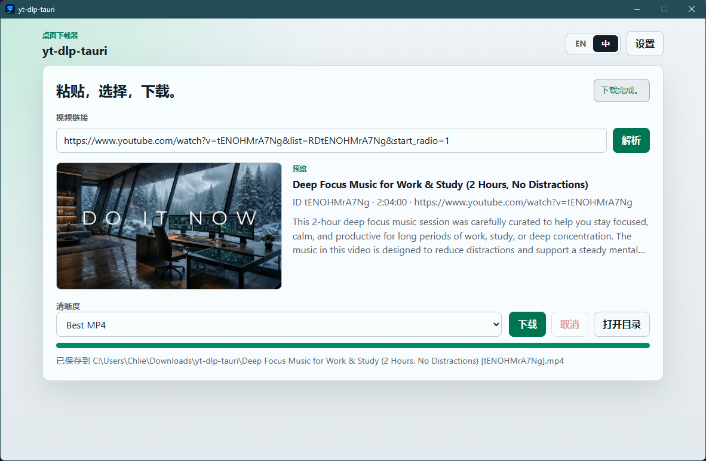

<h1 align="center">yt-dlp-tauri</h1>

<p align="center">
  <strong>一个由 yt-dlp、Tauri 2 和 Rust 驱动的现代化、高颜值桌面视频下载器。</strong>
</p>

<p align="center">
  <a href="./README.md">English README说明</a> ·
  <a href="#快速开始">快速开始</a> ·
  <a href="#核心优化与改进">核心优化与改进</a> ·
  <a href="#配置说明">配置说明</a> ·
  <a href="#项目验证">项目验证</a> ·
  <a href="#相关文档">相关文档</a>
</p>

<p align="center">
  
  
  
  
  
</p>

<p align="center">
  
</p>

> [!NOTE]
> 本项目基于开源项目 [Chlience/yt-dlp-tauri](https://github.com/Chlience/yt-dlp-tauri) 衍生开发。

---

## 项目介绍

`yt-dlp-tauri` 是一个基于 `yt-dlp` 的轻量级本地化桌面应用，旨在帮助用户免除繁琐手写命令行参数的烦恼。只需粘贴视频链接，便可预览标题、封面图、时长、描述等元数据，直接选择清晰度并一键下载为 MP4 友好格式，享受专为桌面端设计的美观纯粹交互。

项目采用本地优先设计，提供完善的本地工具链管理与高度自定义机制。

---

## 核心优化与改进

我们最近对应用的视觉体验和后端架构进行了全面的现代化升级：

### 🎨 高颜值 UI 与微交互动效
* **原生暗色模式**：完整支持自动适配系统的深色主题（`prefers-color-scheme: dark`），使用科学的一致性 OKLCH 色彩体系。
* **微动效与交互反馈**：为设置抽屉设计了丝滑的滑动显隐过渡，为按钮加入了点击按下缩放（`scale(0.97)`）微动效，通知提示框色彩平滑变化，进度条支持流动光泽条纹动画。
* **自由窗口缩放**：取消了原先的固定尺寸，支持最大化并放宽最小尺寸限制至 `820`x`600`，让现有的响应式栅格布局能完美适应各种电脑屏幕。
* **缩略图渐变淡入**：视频元数据解析完成后，封面图支持平滑淡入呈现，切换链接时自动重置。

### ⚡ 健壮高效的 Rust 后端架构
* **模块化解耦**：将原本 2,330+ 行的单体 `lib.rs` 彻底重构，解耦为 `commands/` 业务集、`error.rs`、`state.rs`、`zip_utils.rs` 与 `utils.rs` 底层辅助工具模块。
* **强类型结构化错误处理**：通过 `thiserror` 定义了全局的 `AppError` 错误枚举，在 Rust 侧安全抛错的同时实现 `serde::Serialize` 转化，无缝向下兼容前端报错格式。
* **工具链定位路径缓存**：在 Tauri State 中设计了线程安全的 `CachedToolPaths` 缓存机制，只在首次启动或配置变动时进行磁盘与环境变量扫描，避免每次解析/下载操作的冗余磁盘 I/O。
* **原生 ZIP 解压安全加固**：弃用了在 Windows 下可能引起命令转义与参数注入漏洞的 `powershell Expand-Archive` 调用，引入 Rust 原生 `zip` 库提取工具链，保留 Unix 执行权限且更安全。

---

## 技术栈

| 层级 | 选用技术 |
| --- | --- |
| **桌面运行时** | Tauri 2 |
| **后端** | Rust |
| **前端** | TypeScript, Vanilla JS, CSS3, Vite |
| **本地工具链** | 由应用自行管理的 `yt-dlp`、`ffmpeg`、`ffprobe`、`deno` |
| **构建格式** | Windows NSIS 安装包 |

---

## 快速开始

### 1. 系统要求
* Windows 10/11 且自带 WebView2 运行时。
* Node.js 20+ 或 22+。
* Rust stable 开发套件。

### 2. 运行与构建

安装 Node 依赖：
```powershell
npm ci
```

*(可选)* 还原本地开发环境工具链：
```powershell
.\scripts\download-tools.ps1
```
*提示：如果未运行此开发脚本，可在运行应用后直接在设置面板中点击“安装工具”由应用自动下载。*

以开发模式运行应用：
```powershell
npm run tauri dev
```

在本地构建 Windows 安装包：
```powershell
npm run tauri build
```
编译生成的安装包位置：
`src-tauri\target\release\bundle\nsis\`

---

## 配置说明

| 路径或对象 | 用途 |
| --- | --- |
| `src-tauri/tools-manifest.json` | 固定的依赖工具版本、对应源下载地址以及 SHA-256 哈希值。 |
| `src-tauri/tauri.conf.json` | Tauri 应用的元数据、安全控制（CSP 规则）及打包输出目标。 |
| **设置: 下载保存目录** | 更改视频的保存位置，支持重置与一键打开。 |
| **设置: GitHub 更新镜像** | 更改版本检测时是通过 `Direct`（直连）还是通过国内 `gh-proxy` 镜像源。 |

---

## 数据、存储与输出

* **视频下载默认路径**：`%USERPROFILE%\Downloads\yt-dlp-tauri\`
* **应用状态数据**：`%LOCALAPPDATA%\yt-dlp-tauri\state\`
* **运行事件日志**：`%LOCALAPPDATA%\yt-dlp-tauri\logs\app.log`
* **应用自带工具路径**：`%LOCALAPPDATA%\yt-dlp-tauri\Tools\win-x64\`

---

## 项目验证

### 前端测试
```powershell
npm test
```

### 后端单元测试
```powershell
cargo test --manifest-path .\src-tauri\Cargo.toml --lib
```

### 后端语法检查
```powershell
cargo check --manifest-path .\src-tauri\Cargo.toml
```

---

## 相关文档

* [版本变更日志](./CHANGELOG.md)
* [贡献指南](./CONTRIBUTING.md)
* [安全策略](./SECURITY.md)
* [第三方软件声明](./THIRD-PARTY-NOTICES.md)

---

## Star History

<a href="https://www.star-history.com/?repos=Chlience%2Fyt-dlp-tauri&type=date&legend=top-left">
 <picture>
   <source media="(prefers-color-scheme: dark)" srcset="https://api.star-history.com/chart?repos=Chlience/yt-dlp-tauri&type=date&theme=dark&legend=top-left" />
   <source media="(prefers-color-scheme: light)" srcset="https://api.star-history.com/chart?repos=Chlience/yt-dlp-tauri&type=date&legend=top-left" />
   
 </picture>
</a>

---

## 发布核对清单 (Windows)

在生成和发布 Release 版本前，请核对以下内容：
1. 本地运行上述所有前端与后端的测试验证脚本。
2. 推送格式符合 `v*` 的版本标签（例如 `v0.1.5`）。
3. GitHub Actions 的 Release 自动化工作流会捕获此标签，自动构建 Windows NSIS 安装包并将其上传到 GitHub Release 草稿中。
4. 确认 `src-tauri/tools-manifest.json` 中配置的下载 URL 为固定发布地址而非悬挂的 `latest` 地址。

---

## 法律声明

本项目基于 GPL-3.0 协议开源。应用下载并调用的第三方工具及依赖包遵守其各自的开源协议，详情请查看 [THIRD-PARTY-NOTICES.md](./THIRD-PARTY-NOTICES.md)。

本项目不隶属于、也不由 `yt-dlp`、FFmpeg、Deno 或 Tauri 官方进行维护或授权。
